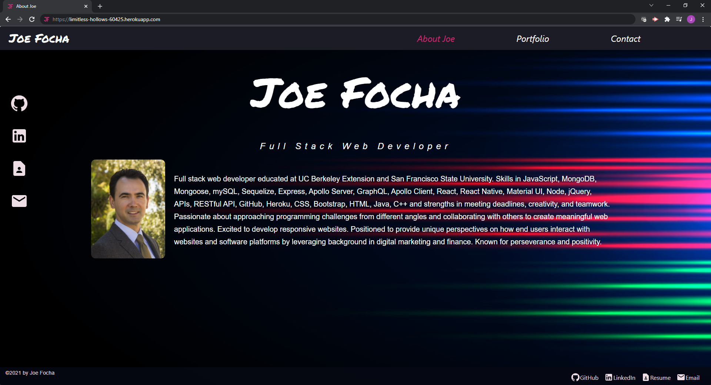

# Portfolio

  

  ## Description 
  
  A showcase of my work.
  

  ## Table of Contents
  
  * [Installation](#installation)
  * [Usage](#usage)
  * [Contributing](#Contributing)
  * [Tests](#tests)
  * [Questions](#questions)
  * [License](#license)
  
  
  ## Installation
  
  None. It's deployed at *[https://limitless-hollows-60425.herokuapp.com](https://limitless-hollows-60425.herokuapp.com)*
  
  
  ## Usage 
  
  Visit the *[site](https://limitless-hollows-60425.herokuapp.com)* 
  
  
  ## Contributing

  Please don't. I got this one.
  
  [Contributor Covenant](https://www.contributor-covenant.org/version/2/0/code_of_conduct/)

  ## Tests
  
  None.

  ## Questions

  You can checkout my repos here: [https://github.com/jfocha](https://github.com/jfocha)

  For further questions, I can also be reached at jfocha@gmail.com

  ## License
  
  Copyright (c) 2021 by Joseph Focha

  This application license is covered under [GNU GPLv3](https://choosealicense.com/licenses/gpl-3.0/)
  
  This program is free software: you can redistribute it and/or modify it under the terms of the GNU General Public License as published by the Free Software Foundation, either version 3 of the License, or (at owner's option) any later version.     This program is distributed in the hope that it will be useful, but WITHOUT ANY WARRANTY; without even the implied warranty of MERCHANTABILITY or FITNESS FOR A PARTICULAR PURPOSE. See the GNU General Public License for more details.     You should have received a copy of the GNU General Public License along with this program. If not, see <https://www.gnu.org/licenses/>.
  
  ---

  
